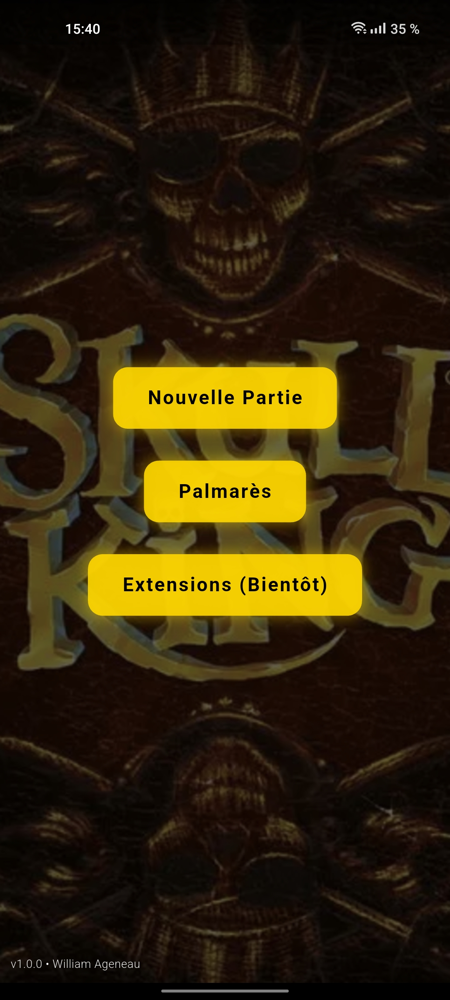
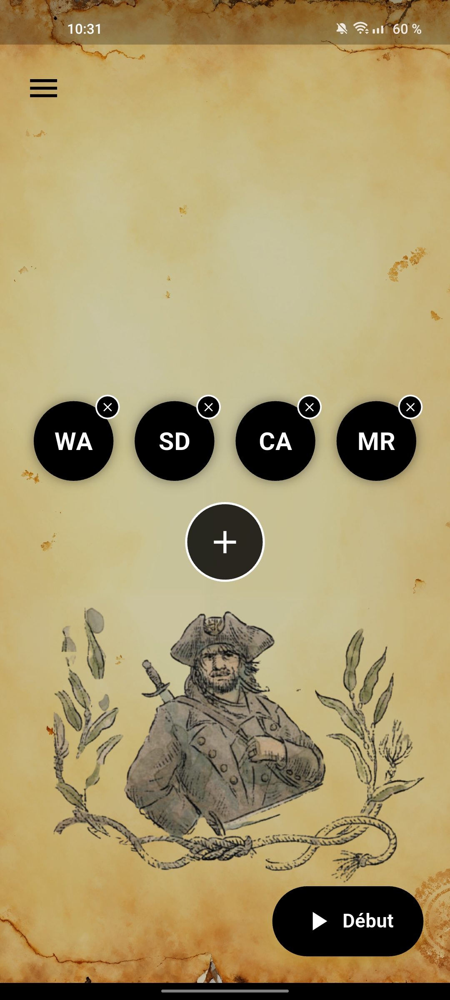
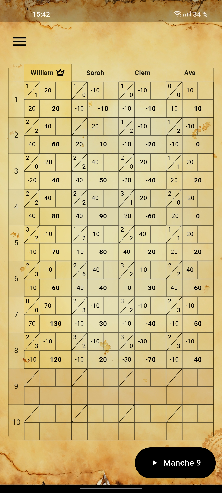
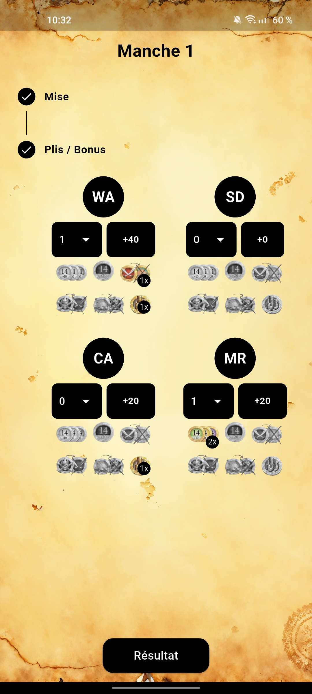
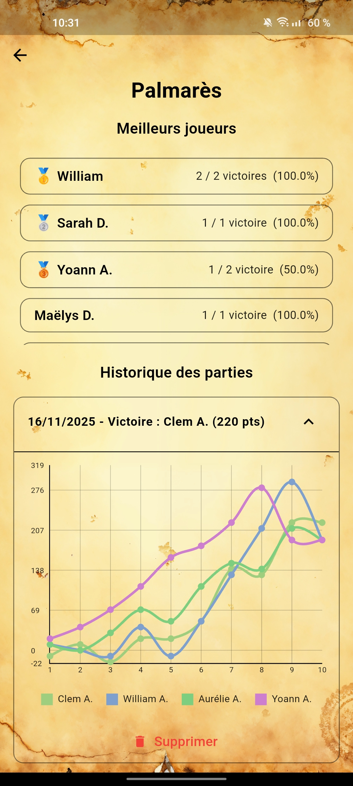

# 🏆 Skull King App – Suivi et Analyse des Scores du jeu Skull King

**Skull King App** est une application Flutter moderne permettant de **suivre, enregistrer et analyser les scores** de plusieurs joueurs sur différentes manches.  
Elle offre un design fluide, une interface intuitive et des graphiques dynamiques pour visualiser la progression de chaque joueur.  

---

## 📸 Aperçu de l’application

| Accueil | Nouvelle partie | Scores |
|:--:|:--:|:--:|
|  |  |  |

| Manches | Graphique d’analyse | 
|:--:|:--:|
|  |  |

---

## 🚀 Fonctionnalités principales

### 🎮 Gestion des parties
- Création rapide d’une partie avec plusieurs joueurs  
- Enregistrement automatique des scores par manche  
- Calcul en temps réel du score cumulé de chaque joueur  
- Sauvegarde et restauration automatique des données  

### 📊 Analyse graphique
- Affichage d’un graphique d’évolution des scores avec **FL Chart**  
- Courbes colorées pour chaque joueur  
- Prise en charge des **valeurs négatives et positives**  
- Mise à l’échelle dynamique selon les résultats  

### 🏅 Historique et meilleurs joueurs
- Historique complet des parties terminées  
- Affichage des **meilleurs joueurs** en fonction de leurs performances cumulées  
- Détails des scores par manche via des **ExpansionTiles interactives**  

### 💾 Sauvegarde locale
- Les données sont stockées localement grâce à `SharedPreferences`  
- Reprise instantanée après fermeture de l’application  

---

## ⚙️ Architecture & Technologies

| Élément | Description |
|:--|:--|
| **Framework** | Flutter 3.x |
| **Langage** | Dart |
| **UI Library** | Material Design + FL Chart |
| **Stockage local** | SharedPreferences |
| **Structure du projet** | MVC simplifié (données / logique / vue) |

---

